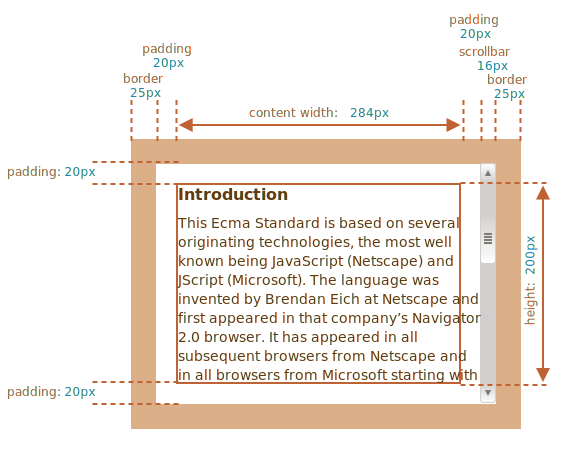
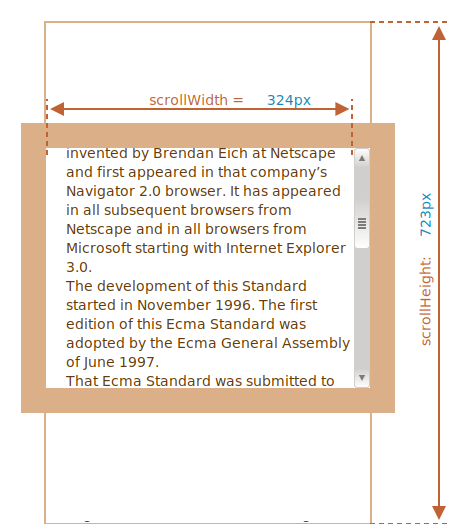
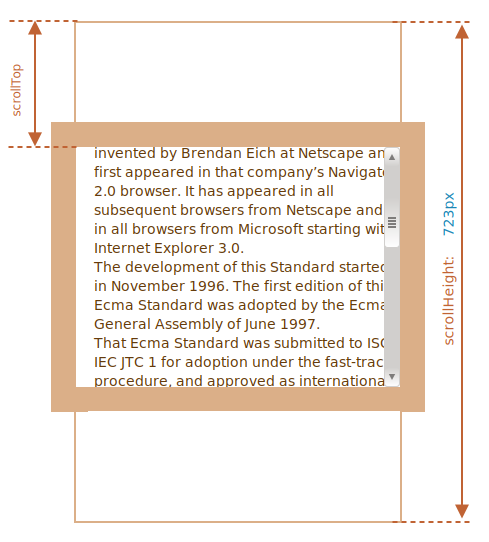

# Розмір і прокрутка елемента

Є багато властивостей JavaScript, які дозволяють нам читати інформацію про ширину, висоту елемента та інші геометричні характеристики.

Ми часто потребуємо їх під час переміщення або позиціонування елементів в JavaScript.

## Зразок елемента


Як зразок елемента для демонстрації властивостей ми використаємо наведений нижче:

```html no-beautify
<div id="example">
  ...Text...
</div>
<style>
  #example {
    width: 300px;
    height: 200px;
    border: 25px solid #E8C48F;
    padding: 20px;
    overflow: auto;
  }
</style>
```

Він має межі, відступи та прокручування. Повний набір функцій. Тут немає полів (margins), оскільки вони не є частиною самого елемента, і для них немає спеціальних властивостей.

Елемент виглядає так:



You can [open the document in the sandbox](sandbox:metric).

```smart header="Зверніть увагу на прокрутку"
На малюнку вище показаний найскладніший випадок, коли елемент має смугу прокрутки. Деякі браузери (не всі) резервують місце для нього, беручи його з вмісту (позначеного вище як «ширина вмісту»).

Таким чином, без смуги прокрутки ширина вмісту становила б 300px, але якщо ширина смуги прокрутки 16px (ширина може відрізнятися залежно від пристрою та браузера), то залишається лише 300 - 16 = 284px пікселів, і ми повинні це враховувати. Ось чому приклади з цього розділу припускають наявність смуги прокрутки. Без нього деякі розрахунки простіші.
```

```smart header="Область `padding-bottom` може бути заповнена текстом"
Зазвичай на наших ілюстраціях відступи відображаються порожніми, але якщо в елементі багато тексту і він переповнюється, то браузери показують «переповнений» текст у `padding-bottom`, це нормально.
```

## Геометрія

Ось загальна картина з властивостями геометрії:


Значення цих властивостей технічно є числами, але ці числа є «пікселями», тому це вимірювання пікселів.

Давайте почнемо досліджувати властивості, починаючи із зовнішнього боку елемента.

## offsetParent, offsetLeft/Top

Ці властивості рідко потрібні, але все ж це «найбільш зовнішні» властивості геометрії, тому ми почнемо з них.

Найближчий предок — це `offsetParent`, який браузер використовує для обчислення координат під час візуалізації.

Це найближчий предок, який є одним із таких:

1. CSS-позиціонування (`position` is `absolute`, `relative`, `fixed` або `sticky`),  або
2. `<td>`, `<th>`, або `<table>`,  або
3. `<body>`.

Властивості `offsetLeft/offsetTop` надають координати x/y відносно верхнього лівого кута `offsetParent`.

У наведеному нижче прикладі внутрішній `<div>` має `<main>` як `offsetParent` і `offsetLeft/offsetTop` зсувається від свого верхнього лівого кута (`180`):

```html run height=10
<main style="position: relative" id="main">
  <article>
    <div id="example" style="position: absolute; left: 180px; top: 180px">...</div>
  </article>
</main>
<script>
  alert(example.offsetParent.id); // main
  alert(example.offsetLeft); // 180 (note: a number, not a string "180px")
  alert(example.offsetTop); // 180
</script>
```


Існує декілька випадків, коли `offsetParent` дорівнює `null`:

1. Для елементів, що не відображаються (`display:none` або ті, що поза документом).
2. Для `<body>` та `<html>`.
3. Для elements з `position:fixed`.

## offsetWidth/Height

Тепер перейдемо до самого елемента.

Ці дві властивості є найпростішими. Вони забезпечують «зовнішню» ширину/висоту елемента. Або, іншими словами, його повний розмір, включаючи межі.


Для нашого зразка елемента:

- `offsetWidth = 390` -- зовнішня ширина, яку можна обчислити як внутрішню CSS-ширину (`300px`) плюс відступи (`2 * 20px`)  і межі (`2 * 25px`).
- `offsetHeight = 290` -- зовнішня висота.

````smart header="
"Властивості геометрії є нуль/null для елементів, які не відображаються"

Властивості геометрії обчислюються лише для відображених елементів.

Якщо елемент (або будь-який із його предків) має  `display:none` або його немає в документі, тоді всі властивості геометрії дорівнюють нулю (or `null` for `offsetParent`).

Наприклад,  `offsetParent` дорівнює `null`, і `offsetWidth`, `offsetHeight` дорівнює `0`, коли ми створили елемент, але ще не вставили його в документ, або він (або його предок) має `display:none`.

Ми можемо використовувати це, щоб перевірити, чи приховано елемент, наприклад:

```js
function isHidden(elem) {
  return !elem.offsetWidth && !elem.offsetHeight;
}
```

Зверніть увагу, що такий `isHidden` повертає `true` для елементів, які є на екрані, але мають нульовий розмір.
````

## clientTop/Left

Всередині елемента ми маємо межі.

Для їх вимірювання існують властивості  `clientTop` and `clientLeft`.

У нашому прикладі:

- `clientLeft = 25` -- ширина лівої межі
- `clientTop = 25` -- ширина верхньої межі


…Але якщо бути точним -- ці властивості не ширина/висота border, а радше відносні координати внутрішньої сторони від зовнішньої.

Яка різниця?

Стає зрозуміло, коли документ написаний справа наліво (операційна система арабською або івритом). Тоді смуга прокрутки розташована не праворуч, а ліворуч, а потім clientLeft також включає ширину смуги прокрутки.

У цьому випадку `clientLeft` матиме не `25`, а ширину смуги прокрутки `25 + 16 = 41`.

Ось приклад на івриті:


## clientWidth/Height

Ці властивості забезпечують розмір області всередині меж елемента.

Вони включають ширину вмісту разом із відступами, але без смуги прокрутки:


На зображенні вище давайте спочатку розглянемо `clientHeight`.

Немає горизонтальної смуги прокрутки, тому це точно сума того, що знаходиться всередині кордонів: CSS-висота `200px` плюс верхній і нижній відступи (`2 * 20px`) загалом `240px`.

Тепер `clientWidth` -- тут ширина вмісту не `300px`, а `284px`, тому що `16px` займає смуга прокрутки. Таким чином, сума становить `284px` плюс відступи ліворуч і справа, разом `324px`.

**Якщо немає відступів, тоді `clientWidth/Height` це саме область вмісту, всередині меж і смуги прокручування (якщо є).**


Отже, коли немає заповнення, ми можемо використовувати `clientWidth/clientHeight`, щоб отримати розмір області вмісту.

## scrollWidth/Height

Ці властивості схожі на `clientWidth/clientHeight`, але вони також включають прокручені (приховані) частини:



На зображенні вище:

- `scrollHeight = 723` --  повна внутрішня висота області вмісту, включаючи прокручувані частини.
- `scrollWidth = 324` -- це повна внутрішня ширина, тут у нас немає горизонтальної прокрутки, тому вона дорівнює `clientWidth`.

Ми можемо використовувати ці властивості, щоб розширити елемент на всю ширину/висоту.

Як тут:

```js
// expand the element to the full content height
element.style.height = `${element.scrollHeight}px`;
```

```online

Натисніть кнопку, щоб розгорнути елемент:

<div id="element" style="width:300px;height:200px; padding: 0;overflow: auto; border:1px solid black;">text text text text text text text text text text text text text text text text text text text text text text text text text text text text text text text text text text text text text text text text text text text text text text text text text text text text text text text text text text text text text text text text text text text text text text text text text text text text text text text text text text text text text text text text text text text text text text text text text text text text text text text text text text text text text text text text text text text text text text text text text text text text text text text text text text text text text text text text text text text text</div>

<button style="padding:0" onclick="element.style.height = `${element.scrollHeight}px`">element.style.height = `${element.scrollHeight}px`</button>
```

## scrollLeft/scrollTop

Властивості  `scrollLeft/scrollTop` це ширина/висота прихованої, прокрученої частини елемента.

На малюнку нижче ми бачимо `scrollHeight` та `scrollTop` для блоку з вертикальною прокруткою.



 
Іншими словами, `scrollTop` означає «скільки прокручується вгору».

````smart header="`scrollLeft/scrollTop` можна змінити"
Більшість властивостей геометрії тут доступні лише для читання, але `scrollLeft/scrollTop` можна змінити, і браузер буде прокручувати елемент.

```online
Якщо клацнути елемент нижче, буде виконано код `elem.scrollTop += 10`.  Це змушує вміст елемента прокручуватися на `10px` вниз.

<div onclick="this.scrollTop+=10" style="cursor:pointer;border:1px solid black;width:100px;height:80px;overflow:auto">Click<br>Me<br>1<br>2<br>3<br>4<br>5<br>6<br>7<br>8<br>9</div>
```

Встановлення  `scrollTop` на `0` або велике значення, наприклад `1e9` змусить елемент прокручуватися до самого верху/низу відповідно.
````

## Не беріть ширину/висоту з CSS

Ми щойно розглянули геометричні властивості елементів DOM, які можна використовувати для отримання ширини, висоти та обчислення відстані.

Але, як ми знаємо з розділу <info:styles-and-classes>, ми можемо читати CSS висоту та ширину за допомогою`getComputedStyle`.

То чому б не прочитати ширину елемента за допомогою `getComputedStyle`, як тут?

```js run
let elem = document.body;

alert( getComputedStyle(elem).width ); // show CSS width for elem
```

Чому ми повинні замість цього використовувати властивості геометрії? Є дві причини:

1. По-перше, CSS `width/height` залежить від іншої властивості: `box-sizing` that defines "what is" CSS width and height. Зміни в `box-sizing` для CSS можуть зламати JavaScript.

2. По-друге, CSS `width/height` може бути `auto`, наприклад для вбудованого елемента:

    ```html run
    <span id="elem">Hello!</span>

    <script>
    *!*
      alert( getComputedStyle(elem).width ); // auto
    */!*
    </script>
    ```
 

    З точки зору CSS, `width:auto` є абсолютно нормальним, але в JavaScript нам потрібен точний розмір у `px` який ми можемо використовувати в обчисленнях. Отже, тут ширина CSS марна.

І є ще одна причина: смуга прокрутки. Іноді код, який добре працює без смуги прокручування, починає працювати з помилками, оскільки смуга прокручування займає простір у вмісті в деяких браузерах. Отже, реальна ширина, доступна для вмісту, менша за ширину CSS. І `clientWidth/clientHeight` враховують це.

…Але з `getComputedStyle(elem).width` ситуація інша. Деякі браузери (наприклад, Chrome) повертають реальну внутрішню ширину без смуги прокрутки, а деякі з них (наприклад, Firefox) -- CSS ширина (ігнорує прокрутку). Такі міжбраузерні відмінності є причиною не використовувати `getComputedStyle`, а радше покладатися на властивості геометрії.

```online
Якщо ваш браузер резервує простір для смуги прокрутки (більшість браузерів для Windows так), ви можете перевірити це нижче.

[iframe src="cssWidthScroll" link border=1]

Елемент із текстом має CSS `width:300px`.

На комп’ютері в ОС Windows, Firefox, Chrome, Edge резервується місце для смуги прокрутки. Але Firefox показує `300px`, а Chrome і Edge -- менше. Це тому, що Firefox повертає ширину CSS, а інші браузери повертають «реальну» ширину.
```

Зверніть увагу, що описана різниця стосується лише читання `getComputedStyle(...).width` з JavaScript,  візуально все правильно.

## Висновок

Елементи мають наступні геометричні властивості:

- `offsetParent` -- це найближчий позиціонований предок або `td`, `th`, `table`, `body`.
- `offsetLeft/offsetTop` --  координати відносно лівого верхнього `offsetParent`.
- `offsetWidth/offsetHeight` -- «зовнішня» ширина/висота елемента, включаючи межі.
- `clientLeft/clientTop` -- відстані від верхнього лівого зовнішнього кута до верхнього лівого внутрішнього (вміст + відступ) кута. Для ОС, орієнтованої зліва направо, це завжди ширина лівої/верхньої рамок. Для ОС, орієнтованої справа наліво, вертикальна смуга прокрутки розташована зліва, тому `clientLeft` також включає її ширину.
- `clientWidth/clientHeight` -- ширина/висота вмісту, включаючи відступи, але без смуги прокрутки.
- `scrollWidth/scrollHeight` -- ширина/висота вмісту, як і `clientWidth/clientHeight`, але також включає прокручену невидиму частину елемента.
- `scrollLeft/scrollTop` -- ширина/висота прокрученої верхньої частини елемента, починаючи з його верхнього лівого кута.

Усі властивості доступні лише для читання, за винятком `scrollLeft/scrollTop`  які змушують браузер прокручувати елемент у разі зміни.
