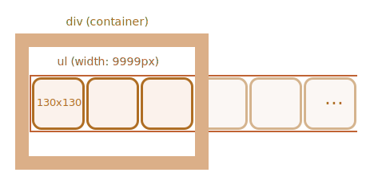

Стрічка зображень може бути представлена як список `ul/li` з картинками ``.

Потрібно розташувати стрічку всередині `
` фіксованого розміру, так щоб одночасно була видна тільки потрібна частина списку:

Щоб список зробити горизонтальним, нам потрібно застосувати CSS-властивість `display: inline-block` для `<li>`.

Для тегу `` ми також повинні налаштувати `display`, оскільки за умовчанням він є `inline`. У всіх елементах типу `inline` резервується додаткове місце під "хвости" символів. І щоб його забрати, нам потрібно прописати `display:block`.

Для прокручування будемо переміщати `<ul>`. Це можна робити по-різному, наприклад, призначенням CSS-властивості `transform: translateX()` (краще для продуктивності) або `margin-left`:

У зовнішнього `
` фіксована ширина, тому зайві зображення обрізаються.

Вся карусель -- це самостійний «графічний компонент» на сторінці, таким чином нам краще його «обернути» в окремий `
` і вже модифікувати стилі всередині нього.
